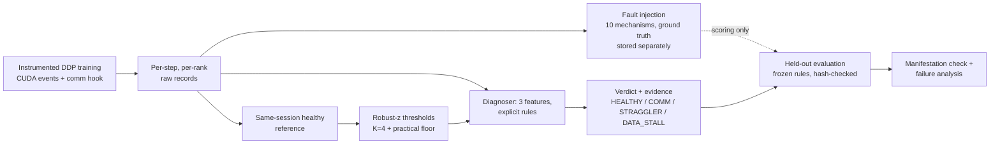

# StepTrace

### StepTrace | Distributed Training Performance Diagnosis

> **Naming note:** StepTrace was developed under the working name *CommScope*. Historical records keep the old name where it is part of the factual record: the build spec filename, the Kaggle bundle/notebook filenames (`commscope.bundle`, `commscope_kaggle_runner.ipynb`), the `COMMSCOPE_*` environment variables, and recorded evidence, campaign ids, hashes and git history.

**Measure where a distributed training step actually goes, inject known faults, and diagnose them with frozen, auditable rules, then check that diagnosis on data the rules never saw.**

> **Scope, stated up front.** Everything here was measured on **one node with 2× NVIDIA Tesla T4** (Kaggle).
> The GPUs talk through NCCL's **`SHM/direct`** transport (host shared memory over PCIe, topology `PHB`, no NVLink).
> There is **no network fabric** in this project: no NIC, InfiniBand, RoCE or multi-node run. Bandwidth throttling
> is **emulated** and labelled as such. Every number is specific to the recorded environment.

<p align="center">
  <br>
  <sub>Healthy ResNet-18 step on 2×T4 (held-out session reference): 37.3 ms, of which ≈4 ms is exposed communication on the critical path. Source: <code>results/plots/m2_heldout/03_time_breakdown.png</code>.</sub>
</p>

## The problem

A data-parallel training step can be slow for very different reasons, and the usual dashboard number ("step time went up") says nothing about which one:

| symptom | real cause | what you would "fix" |
|---|---|---|
| gradient all-reduce not hidden behind backward | **communication** (bucketing, transport, bandwidth) | DDP buckets, topology, fabric |
| one rank finishes compute late, the rest wait in the collective | **straggler** (rank imbalance) | the slow rank, not the network |
| GPU idle at the start of the step | **data stall** (input pipeline) | loader workers, prefetch, preprocessing |

Because DDP is synchronous, a straggler or a data stall shows up as **waiting inside the collective**, which looks exactly like a slow network. Misattribution is the expensive part: you tune the wrong layer. StepTrace is a small, rigorous testbed for telling these apart from *measurements*, and for being honest about when it cannot.

## What StepTrace does



1. **Measures** each step per rank on the GPU timeline (CUDA events, a timing comm hook, a `no_sync` ablation, a `torch.profiler` cross-check).
2. **Injects** controlled faults with ground truth recorded apart from measurements.
3. **Diagnoses** with an explicit rule set (no ML, no LLM): three robust-z features against a healthy reference collected **in the same GPU session**.
4. **Freezes** the rules (hash-recorded, git-tagged) **before** any held-out data exists, then scores held-out data once.
5. **Audits itself**: an independent "did the fault actually act?" check, provenance on every run, SHA256-verified evidence, and a post-hoc failure analysis.

## Headline result: 73.9 % held-out accuracy (17/23), reported as-is

Pre-registered held-out campaign `m2_heldout-20261007-053125`, run from clean code `dc3f5db`, **rules frozen at v1** (file sha256 `f7fae790…ba88`). 23 headline runs; no run failed to manifest.

<p align="center"></p>

| truth \ predicted | HEALTHY | COMMUNICATION | STRAGGLER | DATA_STALL | recall |
|---|---:|---:|---:|---:|---:|
| HEALTHY (5) | **5** | 0 | 0 | 0 | 1.00 |
| COMMUNICATION (6) | 2 | **4** | 0 | 0 | 0.67 |
| STRAGGLER (6) | 1 | 0 | **5** | 0 | 0.83 |
| DATA_STALL (6) | 0 | 0 | 3 | **3** | 0.50 |
| **precision** | 0.62 | 1.00 | 0.62 | 1.00 | **0.739** |

The set was built to be hard on purpose. Split by what the rules had seen during design (derived from the recorded per-run rows):

| held-out subset | correct |
|---|---:|
| healthy controls + design mechanisms at **unseen severities** (healthy ×5, `straggler_sleep_mid` ×2, `data_loader_sleep_mid_v2` ×2) | **9 / 9** |
| **mechanisms never run before the freeze** (emulated bandwidth, SHM-disable, compute straggler, CPU-preprocess stall) | **8 / 14** |

In-sample design accuracy was 1.00 (n = 20 and n = 12); the held-out number is the honest estimate, and the gap is the point of holding data out. With 2 launches per arm the confidence interval is wide; treat per-class figures as indicative only.

### Per-arm held-out outcomes

| arm (2 launches each unless noted) | mechanism | diagnosed | verdict |
|---|---|---|---|
| healthy_fresh (3), healthy_hostloader | none | HEALTHY | 5/5 ✔ |
| comm_emulated_bw_4GBps | emulated bandwidth | COMMUNICATION | 2/2 ✔ |
| comm_shm_disable | real NCCL transport change | COMMUNICATION | 2/2 ✔ |
| **comm_emulated_bw_8GBps** | emulated bandwidth | HEALTHY | **0/2 ✘** |
| straggler_compute_hi, straggler_sleep_mid | GPU work / host sleep on rank 1 | STRAGGLER | 4/4 ✔ |
| **straggler_compute_lo** | extra GPU work, low | STRAGGLER, HEALTHY | **1/2** |
| data_loader_sleep_mid_v2 | worker-side stall | DATA_STALL | 2/2 ✔ |
| **data_cpu_preprocess_lo** | real CPU work in loader workers | STRAGGLER | **0/2 ✘** |
| **data_cpu_preprocess_hi** | real CPU work in loader workers | DATA_STALL, STRAGGLER | **1/2** |
| comm_small_batch_x2 *(marginal arm, excluded from headline)* | batch 32→16 | COMMUNICATION | 2/2 |

<p align="center"></p>

## The failures are findings, not noise

A post-hoc analysis (read-only, no rescoring, rules untouched; [`FAILURE_ANALYSIS.md`](results/analysis/m2_heldout_failure_analysis/FAILURE_ANALYSIS.md)) recomputed the diagnoser's features from raw steps with independent code (max difference **0.0**) and found **no implementation bug**. The 6 misses fall into two causes:

**1. Severity boundary (3 misses): `comm_emulated_bw_8GBps` ×2, `straggler_compute_lo` ×1.**
The 8 GB/s signal is statistically unmistakable (robust z ≥ 20 in 6/6 blocks) yet only **+1.03…1.13 ms** of the injected 5.59 ms is *exposed* (the rest hides behind backward). The practical floor (3 % of step) is 1.118 ms, so 5 of 6 blocks fall just under it. The low compute straggler had a 1.5–2.4 ms effect against a requirement of z ≥ 4 and ≥ 1.12 ms; the injected GPU work was realized at well under its calibrated size.

**2. Observable ambiguity (3 misses): `data_cpu_preprocess` lo ×2, hi ×1 → called STRAGGLER.**
CPU-heavy loader workers share 4 vCPUs with the training processes. One physical cause produces **two** signatures: the loader delivers late (host wait) **and** the training processes slow down unevenly (per-rank compute +47…86 %, skew 4–18 ms). DATA_STALL was elevated in **12/12** blocks and reported as the *secondary* cause every time; the frozen rule names whichever effect is larger, and that was compute skew. A real CPU-bound input pipeline can look like a straggler to any skew-based detector.

<p align="center"></p>

## Measurement: what is actually timed

Per step and per rank, on the **device timeline** (CUDA events resolved after one `synchronize` per step; host clocks would only measure kernel *launch*):

| metric | meaning |
|---|---|
| `step_time_ms` | `opt_end − start` |
| `data_wait_ms` | GPU idle while the host obtains the batch (+ H2D copy) |
| `compute_time_ms` | accumulation + forward + backward-to-last-gradient + optimizer |
| `communication_time_ms` | all-reduce busy time, hidden or not |
| `exposed_communication_time_ms` | `max(0, end_last_collective − grads_ready)`: communication on the critical path |
| `ddp_finalize_ms` | DDP's post-communication work |

* A **DDP comm hook** timestamps every gradient bucket (`ready_k` on the compute stream, `end_k` inside the future callback); a collective's true start is `max(ready_k, end_{k−1})` because one process group runs collectives serially. Physically impossible orderings are counted and gated, not clamped.
* **Two independent exposed-communication estimates**: the per-step timeline, and a paired **`no_sync` ablation** (`median(DDP step) − median(no_sync step)`), which also captures interference and bucket-copy costs. In the held-out session reference the ablation was **7.91 ms** against ≈3.6 ms timeline exposure on the last bucket: both are reported, and the gap is information.
* A **`torch.profiler` window** cross-checks the hook against NCCL kernel intervals. Pre-registered **validation gates** (decomposition closes, causality, bytes = gradient bytes, hook overhead ≤ 3 %, …) must pass in every session.

Workload (chosen by a pre-registered pilot rule, not by taste): **ResNet-18, batch 32/GPU, FP32, synthetic device-resident data**: 44.7 MB of gradients, a communication-relevant regime on this hardware (collective bus bandwidth plateaus near 4 GB/s through host shared memory).

## Diagnosis: deliberately simple

| class | rule (per block, then majority over blocks) |
|---|---|
| DATA_STALL | `data_wait_ms` elevated |
| STRAGGLER | `compute_skew_ms` = max − min rank compute, elevated |
| COMMUNICATION | `exposed_min_ms` (the **minimum** over ranks, so straggler wait does not leak in) or its fraction elevated |
| HEALTHY | nothing elevated |

*Elevated* ⇔ robust z = (x − median_ref) / max(1.4826·MAD, 1 %·median, abs floor) **≥ 4** *and* delta ≥ practical floor (3 % of the healthy step, or 3 pp for fractions). Several elevated: the primary cause is the larger estimated critical-path ms; others are listed as secondary. "Confidence" is rule agreement across blocks (e.g. 3/3), **not a probability**. Every verdict carries a reason string with value, reference, delta, z and thresholds.

**Why not ML / an LLM?** At this sample size (tens of runs) a learned model would be unauditable and easy to overfit; explicit rules can be frozen, hashed, and every miss traced to a feature and a threshold, as the failure analysis above does.

## Experimental integrity (the part most projects skip)

* **Same-session healthy reference.** Cloud GPUs differ between sessions, so thresholds are recomputed from healthy runs collected *before any fault in the same session*.
* **Design → freeze → held-out.** Rules were derived from design evidence only; `diagnose.freeze` writes `diagnose/frozen/rules_v1.json` (hashes of rule files and manifestation criteria, constants, design-evidence hashes) and **refuses** if the tree is dirty, evidence is unverified, or any held-out data already exists. The evaluator refuses held-out scoring unless the file hash and the current rule files match. Tag: `evaluation-rules-frozen`.
* **Manifestation is separate from diagnosis.** An independent check (`faults/manifestation.py`, also frozen) asks whether an injected mechanism acted at all; a run that slowed down but was misdiagnosed is always a miss, never excused.
* **Audits before the freeze.** The design evidence audit found and fixed a mis-specified loader-stall manifestation check (median under-reported a bimodal wait) *before* freezing; weak design arms (`comm_small_batch`, `data_loader_sleep_lo`) were replaced with documented reasons ([`DECISIONS.md`](DECISIONS.md)).
* **Provenance.** Every run records git SHA, clean/dirty state, config, environment, seed and timestamps; every launcher refuses to run from a dirty tree; code reaches Kaggle as a verified `git bundle`; raw evidence is ingested with SHA256 manifests and never overwritten.
* **CI:** CPU-only GitHub Actions (pyflakes, frozen-rule integrity, notebook compile, unit and Gloo integration tests). Last recorded full local run: 116 passed, 1 failed (`test_optimize.py::test_tuning_to_validation_workflow`, cause not investigated), 3 not run (`test_train_gloo.py`).

## Fault taxonomy

| class | mechanism | nature |
|---|---|---|
| COMMUNICATION | `single_bucket` (one 1 GB bucket, no overlap), `small_batch`, `emulated_bandwidth`, `shm_disable` (NCCL SHM/P2P off) | real config / **emulated** / real transport |
| STRAGGLER | `sleep` (host), `compute` (calibrated GPU matmuls) on rank 1 | injected delay / real work |
| DATA_STALL | `loader_sleep`, `fetch_sleep`, `cpu_preprocess` | injected delay / real CPU work |

## What this does and does not support

**Supported by recorded evidence:** a reproducible method for decomposing a DDP step on this setup; a frozen rule set whose held-out accuracy is **0.739 on n = 23** (9/9 on healthy and design-mechanism controls, 8/14 on unseen mechanisms); documented, evidence-backed reasons for each miss.

**Not supported / not claimed:**
* Anything about multi-node training, InfiniBand/RoCE, NVLink/NVSwitch, other GPUs or models, or production workloads.
* That `emulated_bandwidth` represents a real slow link; it is a spin-kernel delay.
* Generalization beyond 2 launches per held-out arm; no confidence intervals are claimed.
* Optimization gains. An optimization layer (`optimize/`: tuning → fresh-session validation → correctness gate) is implemented and CPU-tested, but **no GPU optimization campaign has been run, so no speed-up is reported.**
* M1 headline numbers (ablation 7.08 ms, 18.2 % of the step, ResNet-18 b32 selection) are **historical**: their raw artifacts were lost and they are not used as evidence anywhere.

See [`LIMITATIONS.md`](LIMITATIONS.md) for the full list.

## Roadmap to real infrastructure (not done)
Multi-node NCCL over a real fabric with per-link counters; real bandwidth limits (`tc`/switch QoS) to replace emulation; larger models with realistic overlap; a CPU-contention-aware data-stall signature (e.g. using common-mode compute inflation, evaluated as a **new** frozen rule version on fresh design and held-out data); severity ladders to map detection thresholds. Details in [`BUILDER_GUIDE.md`](BUILDER_GUIDE.md).

## Repository map

```
workloads/   instrumented DDP loop (train.py), models, data sources, config schema
instrument/  step_timer (CUDA events), comm_hook, timeline (metric derivation), profiler,
             gpu_metrics, nccl_log, environment, provenance, evidence, schema
faults/      spec.py (taxonomy + ground truth), runtime.py (injectors), manifestation.py
diagnose/    features.py, thresholds.py, rules.py, diagnose.py, evaluate.py, freeze.py, frozen/rules_v1.json
analysis/    summary (statistics), validation (gates), pilot (selection), plots (8 evidence plots)
optimize/    search.py, report.py, metrics.py   (CPU-verified; no GPU results yet)
scripts/     run_campaign.py, audit_campaign.py, analyze_heldout_failures.py, make_kaggle_bundle.py, ...
configs/     pilot/baseline + campaigns/ (m2_design, m2_design_r2_verify, m2_heldout, m3_tuning)
results/     session1, session1b_verify, heldout (ingested evidence), analysis/, plots/
tests/       CPU-only unit + Gloo integration tests
```

## Quickstart

```bash
pip install -r requirements.txt                 # locally: CPU torch from download.pytorch.org/whl/cpu
python scripts/detect_environment.py            # what hardware is here
python -m pytest -q                             # CPU-only tests (a few are slow)

# GPU host with ≥ 2 GPUs (Kaggle 2×T4): see notebooks/commscope_kaggle_runner.ipynb
python scripts/make_kaggle_bundle.py            # clean tree only -> dist/commscope.bundle
python scripts/run_campaign.py --campaign configs/campaigns/m2_design.yaml

# score (held-out requires the frozen record and its exact hash)
python -m diagnose.evaluate --manifest <campaign>/manifest.json --roles heldout \
    --frozen-rules diagnose/frozen/rules_v1.json \
    --frozen-rules-sha256 f7fae7907bb4985b5951ad7f89de61281e38fe4d00d802b78141bb21750dba88 \
    --marginal-arms comm_small_batch_x2

# regenerate the evidence plots and the failure analysis from the ingested held-out evidence
python -m analysis.plots --campaign results/heldout/campaigns/m2_heldout-20261007-053125/manifest.json \
    --evaluation results/heldout/campaigns/m2_heldout-20261007-053125/evaluation_heldout.json --out results/plots/m2_heldout
python scripts/analyze_heldout_failures.py
```
Without 2 GPUs the scripts fall back to 2 CPU processes over Gloo and write to `results/dev/`; those are plumbing checks, never results. `COMMSCOPE_ALLOW_DIRTY=1` is a development-only override that is recorded in the run.

## Documentation
[`BUILDER_GUIDE.md`](BUILDER_GUIDE.md) (deep walkthrough, Hinglish) · [`INTERVIEW_GUIDE.md`](INTERVIEW_GUIDE.md) · [`METHODOLOGY.md`](METHODOLOGY.md) · [`EXPERIMENTS.md`](EXPERIMENTS.md) · [`DECISIONS.md`](DECISIONS.md) · [`LIMITATIONS.md`](LIMITATIONS.md)
