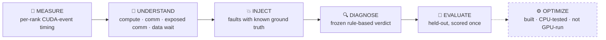
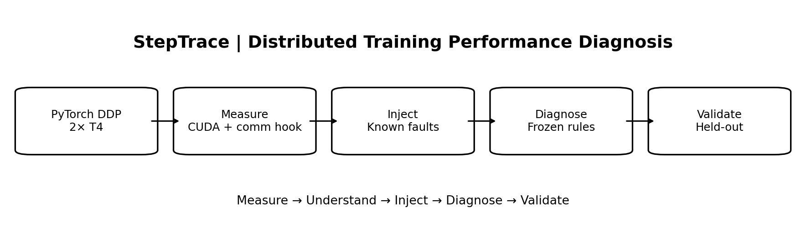
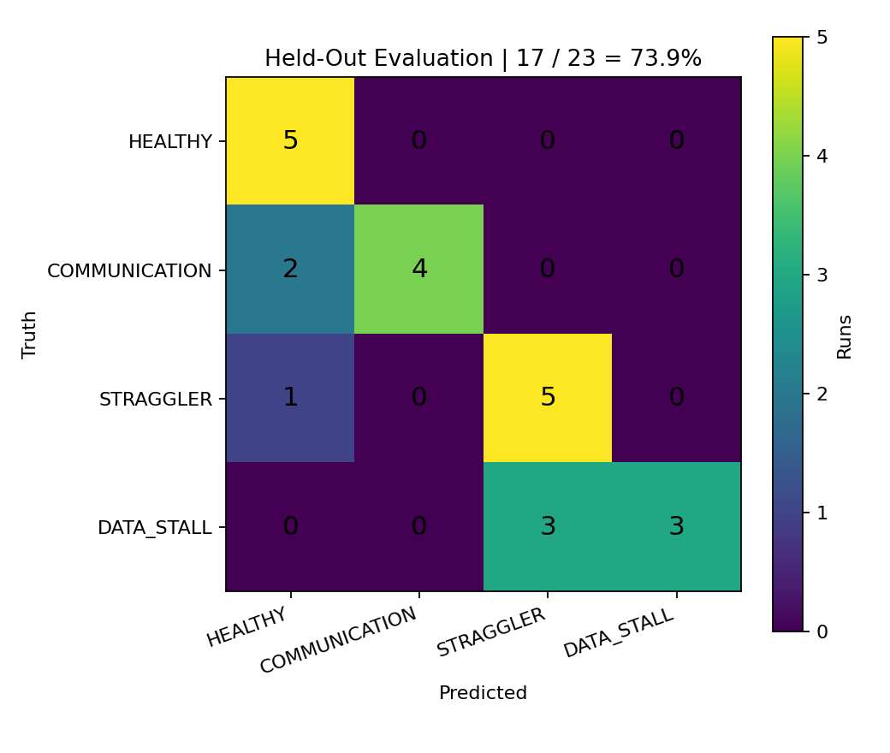
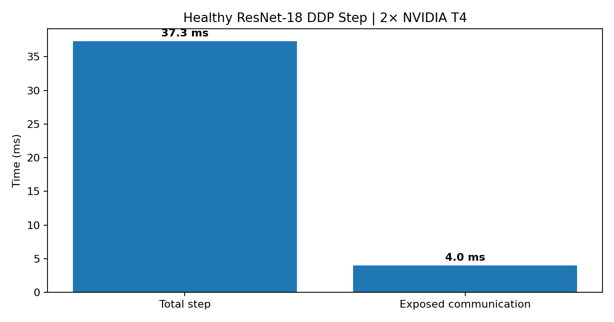
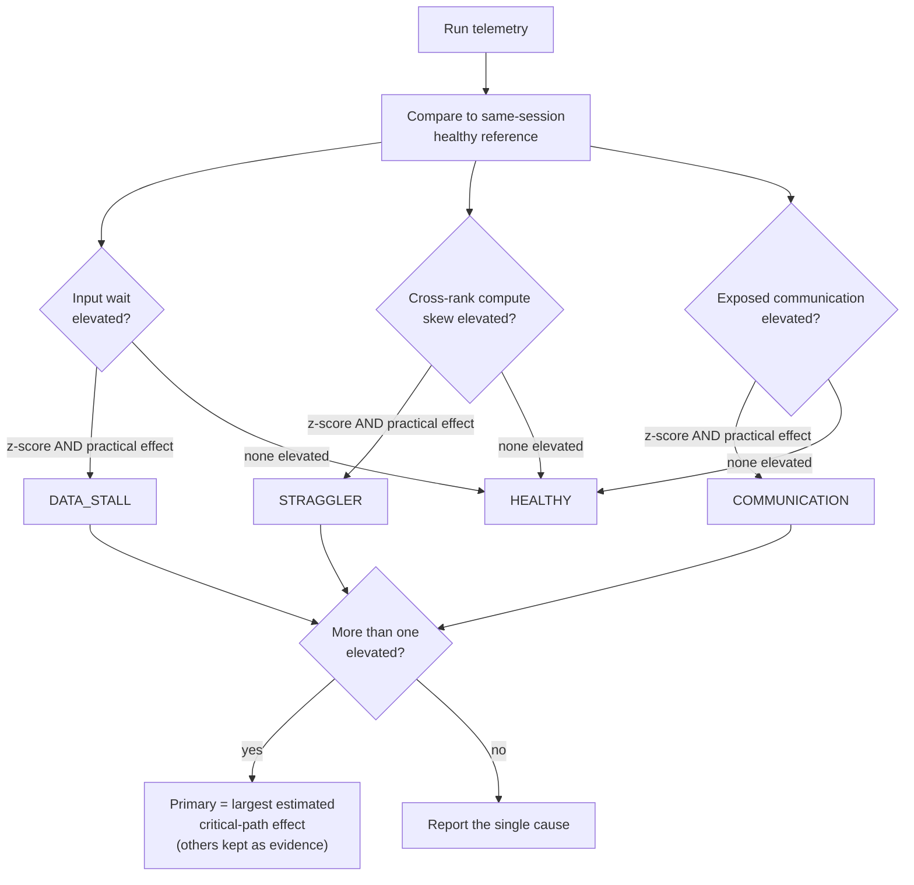
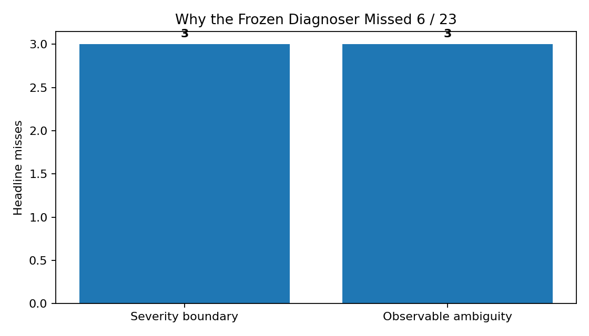

<div align="center">

# StepTrace

### Your GPUs are waiting. StepTrace tells you *what for*.

**An auditable testbed that measures where a distributed PyTorch training step spends its time, injects faults with known ground truth, and diagnoses the cause with frozen rules — then scores itself on data it never saw.**


**[The Question](#the-question) • [Results](#results-at-a-glance) • [How It Works](#how-it-works) • [Diagnoser](#how-the-diagnoser-decides) • [Integrity](#why-you-can-trust-the-numbers) • [Misses](#what-the-diagnoser-got-wrong) • [Scope](#scope-and-honest-limits) • [Quickstart](#quickstart)**

</div>

---

## The Question

> **Why isn't the GPU fully utilized during distributed training — and can a tool tell whether the cause is communication, a straggler, or a data stall?**

A slow synchronous step doesn't announce its cause. DDP synchronizes ranks, so a **straggler** or an **input stall** can delay collective progress and appear as communication-related waiting.

StepTrace separates those signatures, labels each fault with ground truth, and then asks the hard question: *does the diagnosis hold up on faults it was never designed against?*



<div align="center">

[](docs/assets/architecture.png)

</div>

---

## Results at a Glance

<div align="center">

| | |
|:---:|:---:|
| **17 / 23** | **9 / 9** |
| held-out runs diagnosed correctly (**73.9%**) | healthy runs and design-mechanism controls correct |
| **8 / 14** | **37.3 ms** |
| held-out unseen fault mechanisms diagnosed correctly | median healthy step · ResNet-18 · FP32 · batch 32/GPU · ≈4 ms exposed communication |

</div>

The gap between **9/9** and **8/14** is the finding, not a footnote. The diagnoser is reliable on what it was designed around and measurably weaker on new mechanisms. Reporting that honestly is the point of holding data out.

<div align="center">

[](docs/assets/confusion_matrix.png)

</div>

| Truth | Correct | Recall |
|---|:---:|:---:|
| HEALTHY | 5 / 5 | 1.00 |
| COMMUNICATION | 4 / 6 | 0.67 |
| STRAGGLER | 5 / 6 | 0.83 |
| DATA_STALL | 3 / 6 | 0.50 |

> Only two launches per fault arm. Per-class numbers have limited statistical power and should be read as a measured snapshot, not a confidence interval.

---

## How It Works

| Stage | What happens |
|---|---|
| **1 · Measure** | Per-rank step timing with **CUDA events**; DDP gradient buckets timestamped through a **communication hook**; `torch.profiler` as a kernel-level cross-check |
| **2 · Understand** | Two independent estimates of communication exposure: a critical-path timeline and a paired **`DDP − no_sync`** ablation |
| **3 · Inject** | Controlled **communication**, **straggler**, and **data-pipeline** faults, each stored with its ground-truth label, kept apart from the measurements |
| **4 · Diagnose** | Robust-z thresholds against a **same-session healthy reference**; plain rules, **no ML or LLM** |
| **5 · Evaluate** | Rules frozen and hashed *before* held-out scoring; every miss analyzed, none retuned away |

### The measurement model

| Metric | Meaning |
|---|---|
| `step_time_ms` | End-to-end measured training step |
| `data_wait_ms` | GPU-side wait for batch delivery / H2D |
| `compute_time_ms` | Accumulation + forward + backward-to-last-gradient + optimizer |
| `communication_time_ms` | DDP all-reduce busy time |
| `exposed_communication_time_ms` | Communication on the critical path (not hidden behind compute) |
| `ddp_finalize_ms` | Post-communication DDP work |
| `compute_skew_ms` | Cross-rank compute imbalance |

---

## Where a Healthy Step Goes

A healthy ResNet-18 FP32 step at batch 32/GPU had a median of **37.3 ms**, with about **4 ms of exposed communication** on the critical path. That small share matters: it sets how much a fault must add before it can be told apart from noise.

<div align="center">

[](docs/assets/healthy_step.png)

</div>

---

## How the Diagnoser Decides



A signal must clear **both** a robust z-score and a practical-effect threshold, so statistical noise on a tiny effect can't trigger a verdict. When several causes are elevated, the verdict is the largest critical-path effect and the rest stay attached as evidence.

---

## Why You Can Trust the Numbers

| Practice | Why it matters |
|---|---|
| **Same-session healthy reference** | Cloud GPU performance drifts between sessions; every threshold is calibrated against a reference from the same session |
| **Frozen, hashed rules** | Rules are written to a versioned file, SHA256-hashed, and tied to a Git tag; the evaluator refuses to score held-out data if the hash doesn't match |
| **Manifestation ≠ diagnosis** | A fault that never produced its intended effect is reported as *did not manifest*, never silently counted as a diagnoser miss |
| **Ground truth kept separate** | The correct answer is stored apart from measurements, and the diagnoser cannot see it |
| **Full provenance** | Every run records config, environment, seed, timestamp, Git state, and fault label; official runs refuse to start from a dirty tree |
| **Immutable raw evidence** | Results are ingested with SHA256 manifests and verified before use |
| **Failures stay failures** | Held-out misses were analyzed independently, without rescoring or changing the frozen rules |

---

## What the Diagnoser Got Wrong

Six runs were misdiagnosed. They were not discarded or tuned away.

<div align="center">

[](docs/assets/failure_analysis.png)

</div>

**Severity boundary: 3 misses.** Two `comm_emulated_bw_8GBps` runs and one low-severity compute-straggler run sat near the frozen detection boundary. The communication signal was elevated, but too little of the injected delay became exposed critical-path time to clear the practical detection floor consistently.

**Observable ambiguity: 3 misses.** CPU-heavy loader preprocessing competed for the four available vCPUs, which raised both input wait *and* per-rank compute unevenly. One physical cause produced two signatures. The frozen rule picked the larger observed effect, and was wrong about which label the experiment had assigned.

Both are findings about the detector. Neither is a reason to move the score.

---

## Scope and Honest Limits

All GPU evidence comes from **one node with 2× NVIDIA Tesla T4 on Kaggle**, with NCCL over `SHM/direct` through the host/PCIe path. Topology was `PHB`, and there was **no NVLink**.

| StepTrace **is** | StepTrace is **not** |
|---|---|
| A single-node DDP performance-diagnosis testbed | A multi-node network-fabric study |
| An evaluation of a rule-based diagnoser against injected faults | InfiniBand, RoCE, NIC, switch, or production-cluster measurements |
| Reproducible within the recorded environment | A claim about other GPU families or arbitrary models |
| Honest about emulated bandwidth degradation | A claim that emulated delay equals a real slow link |

Also not claimed: statistically strong intervals from two launches per held-out arm, and **GPU optimization speedups**. An optimization layer exists and is CPU-tested, but no GPU optimization campaign was run, so no speed-up is reported.

---

## Repository

```text
workloads/    instrumented DDP workload, models, data/config schema
instrument/   CUDA timing, communication hooks, timelines, profiler, provenance
faults/       fault taxonomy, runtime injectors, manifestation checks
diagnose/     features, thresholds, rules, evaluation, freeze logic
analysis/     statistics, validation gates, pilot selection, plots
optimize/     tuning and validation framework (CPU-tested)
scripts/      experiment and validation tooling
configs/      baseline, pilot, and public design campaign configurations
tests/        CPU-only unit and Gloo integration tests
tools/        evidence ingestion and SHA256 verification
```

Generated experiment evidence and internal development guides are intentionally not part of the public repository.

---

## Quickstart

```bash
pip install -r requirements.txt
python scripts/detect_environment.py
python -m pytest -q
```

Without two GPUs, the project exercises its plumbing through **CPU/Gloo**. Those runs are development checks, not GPU performance evidence.

The reported GPU campaign ran on Kaggle with 2× Tesla T4. The measurement and campaign tooling expects a host with at least two GPUs; see `configs/` for the public campaign definitions and `instrument/`, `faults/`, `diagnose/` for the source.

---

## Future Work

- Real multi-node NCCL over a physical network fabric, with real bandwidth controls
- Larger workloads with stronger compute/communication overlap
- CPU-contention-aware input signatures, to separate the data-stall and straggler ambiguity found above
- Broader severity ladders near the detection boundary
- A GPU optimization campaign with fresh-session validation

These are **future experiments**, not current results.

---

<div align="center">

**Measure → Understand → Inject → Diagnose → Evaluate**

*A diagnoser you can believe is one that tells you where it fails.*

</div>
